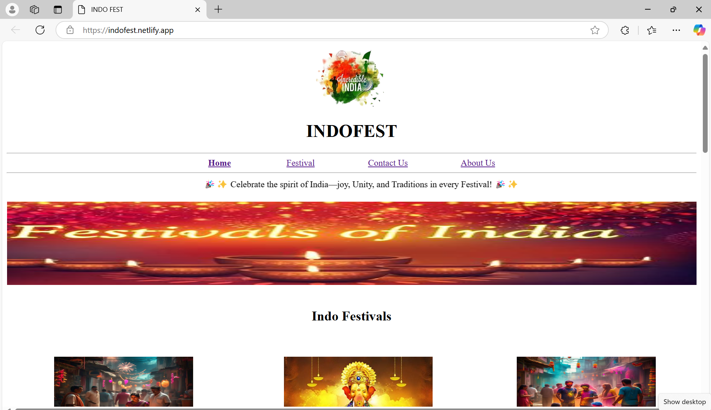
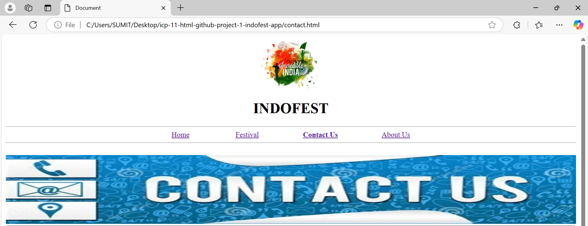
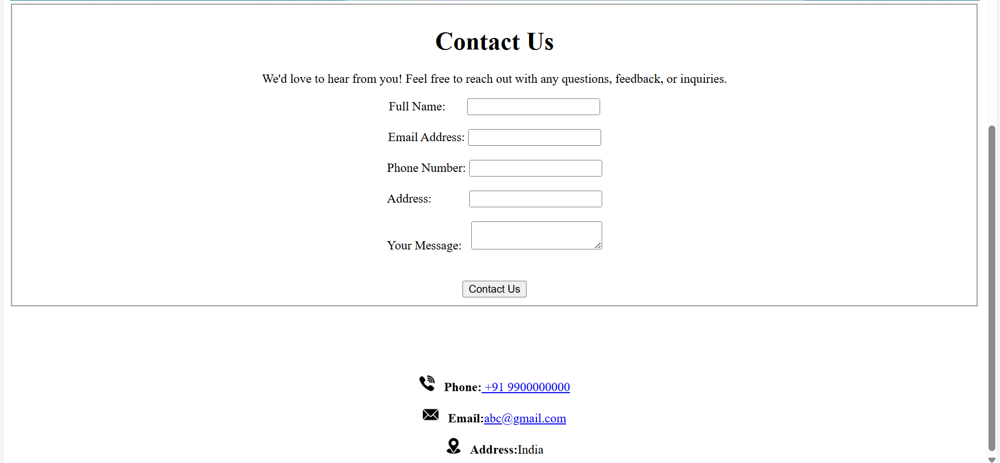

# IndoFest
---
Click here to visit our web:- [IndoFest](https://indofest.netlify.app/)
---
**Home**
---

---
---
**Festival**
---

---
---

**Contact**
---

---
---
**Abou Us**
---

---
---
**Use of Project:-**

1. The IndoFestival Website serves as a digital platform to showcase and promote various cultural, traditional, and modern festivals celebrated across Indonesia.
2.  It provides visitors with information about festival schedules, event details, history, and cultural significance. 
3.   The website also acts as a bridge between local event organizers, tourists, and festival enthusiasts by offering an interactive and engaging user experience.
  
**Description:-**

The IndoFestival Website is a user-friendly, visually appealing, and information-rich platform dedicated to Indonesian festivals. The site includes key features such as:
- Festival Listings – Comprehensive details on upcoming and past festivals.
- Event Schedules – Timelines, locations, and event highlights.
- Cultural Insights – Background, traditions, and significance of various festivals.
- Multimedia Content – Photos, videos, and virtual experiences.
- Ticket Booking & Registration – Online reservations for events.
- Community Engagement – Social media integration, forums, and user-generated content.
  
It aims to provide an immersive experience for locals and international tourists who want to explore the vibrant cultural heritage of India.

**Real-Life Use:-**
- Tourism & Travel – Helps travelers plan their trips around major festivals.
- Event Promotion – Assists local festival organizers in reaching a global audience.
- Cultural Education – Acts as a learning resource for students and cultural enthusiasts.
- Economic Impact – Supports local businesses, artisans, and food vendors by attracting festival-goers.
- Community Building – Connects festival lovers, artists, and performers through an interactive platform.

**Future Scope:-**
- Mobile App Development – A dedicated mobile app for better accessibility.
- AI-Powered Personalization – Smart recommendations based on user preferences.
- Augmented Reality (AR) & Virtual Reality (VR) – Virtual festival experiences.
- Multi-Language Support – To cater to international tourists.
- E-commerce & Marketplace – Online store for festival-related merchandise.
- Live Streaming & Virtual Participation – Enabling users to join events remotely.
This project has immense potential to evolve into a global hub for cultural tourism, making Indian festivals more accessible and engaging to audiences worldwide.